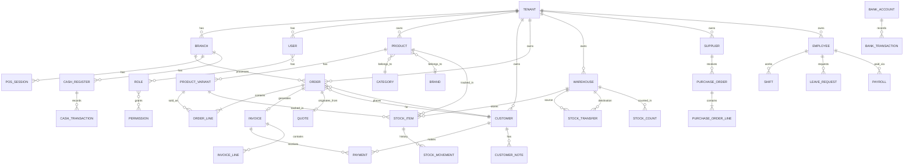
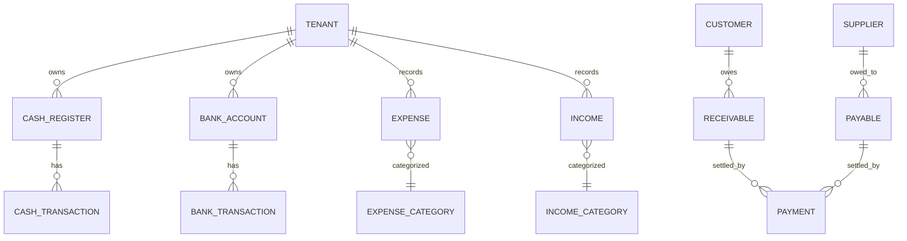

# Karasu ERP — Database Design & Entity Relationships

---

## 1. ER Diagram (Core Entities)



---

## 2. Finance Module ER



---

## 3. Base Entity Pattern

Tüm tenant-scoped entity'ler şu base'den türer:

```csharp
public abstract class BaseEntity
{
    public Guid Id { get; set; }
    public DateTime CreatedAt { get; set; }
    public Guid? CreatedBy { get; set; }
    public DateTime? UpdatedAt { get; set; }
    public Guid? UpdatedBy { get; set; }
    public bool IsDeleted { get; set; }  // Soft delete
}

public abstract class TenantEntity : BaseEntity
{
    public Guid TenantId { get; set; }
    public virtual Tenant Tenant { get; set; }
}

public abstract class AuditableEntity : TenantEntity
{
    // Audit interceptor tarafından yönetilir
}
```

---

## 4. Core Tables Schema

### 4.1 Tenant & Identity

| Table | Key Columns | Notes |
|-------|-------------|-------|
| `Tenants` | Id, Name, Slug, BusinessType, Plan, SettingsJson | Root tenant |
| `Branches` | Id, TenantId, Name, Code, Address, IsActive | Şubeler |
| `AspNetUsers` | Id, TenantId, Email, FullName | Extended Identity |
| `Roles` | Id, TenantId, Name, IsSystemRole | Tenant-scoped roles |
| `Permissions` | Id, Module, Entity, Action, Description | Global permission catalog |
| `RolePermissions` | RoleId, PermissionId | M2M |
| `UserRoles` | UserId, RoleId | M2M |
| `RefreshTokens` | Id, UserId, Token, ExpiresAt, IsRevoked, ReplacedByToken | Rotation |
| `AuditLogs` | Id, TenantId, UserId, EntityType, EntityId, Action, OldValues, NewValues, IpAddress, CreatedAt | Immutable |

### 4.2 Catalog (Product Management)

| Table | Key Columns | Notes |
|-------|-------------|-------|
| `Categories` | Id, TenantId, Name, ParentId, SortOrder | Hierarchical |
| `Brands` | Id, TenantId, Name | |
| `Units` | Id, TenantId, Name, Symbol | Adet, Kg, Lt |
| `Products` | Id, TenantId, Sku, Barcode, Name, CategoryId, BrandId, UnitId, PurchasePrice, SalePrice, TaxRate, MinStock, ImageUrl, Status | |
| `ProductVariants` | Id, TenantId, ProductId, Sku, Barcode, AttributesJson, PurchasePrice, SalePrice, ImageUrl | Beden/Renk |
| `ProductImages` | Id, ProductId, Url, IsPrimary, SortOrder | |

### 4.3 CRM (Customer Management)

| Table | Key Columns | Notes |
|-------|-------------|-------|
| `Customers` | Id, TenantId, Type, FullName, CompanyName, TaxNumber, Phone, Email, Address, City, Balance, CreditLimit, Status | |
| `CustomerNotes` | Id, TenantId, CustomerId, Content, CreatedBy | |
| `CustomerAttachments` | Id, TenantId, CustomerId, FileName, FileUrl, UploadedBy | |

### 4.4 Sales (Order Management)

| Table | Key Columns | Notes |
|-------|-------------|-------|
| `Quotes` | Id, TenantId, CustomerId, QuoteNumber, Status, SubTotal, TaxTotal, DiscountTotal, GrandTotal, ValidUntil | Teklif |
| `QuoteLines` | Id, QuoteId, ProductVariantId, Quantity, UnitPrice, TaxRate, Discount | |
| `Orders` | Id, TenantId, BranchId, CustomerId, OrderNumber, Status, Type, SubTotal, TaxTotal, DiscountTotal, GrandTotal, Notes | |
| `OrderLines` | Id, OrderId, ProductVariantId, Quantity, UnitPrice, TaxRate, Discount, LineTotal | |
| `OrderStatusHistory` | Id, OrderId, FromStatus, ToStatus, ChangedBy, ChangedAt, Note | |
| `Invoices` | Id, TenantId, OrderId, CustomerId, InvoiceNumber, Type, Status, SubTotal, TaxTotal, GrandTotal, IssuedAt | |
| `InvoiceLines` | Id, InvoiceId, Description, Quantity, UnitPrice, TaxRate, LineTotal | |
| `Payments` | Id, TenantId, CustomerId, InvoiceId, OrderId, Amount, Method, ReferenceNo, PaidAt | |

**Order Status Enum:** Draft → Pending → Confirmed → Preparing → Shipping → Delivered | Cancelled

### 4.5 POS

| Table | Key Columns | Notes |
|-------|-------------|-------|
| `PosSessions` | Id, TenantId, BranchId, CashierId, OpenedAt, ClosedAt, OpeningBalance, ClosingBalance, Status | |
| `PosTransactions` | Id, SessionId, OrderId, PaymentMethod, Amount, ChangeAmount, CreatedAt | |
| `PosReturns` | Id, SessionId, OriginalOrderId, Reason, RefundAmount, RefundMethod | |

### 4.6 Inventory

| Table | Key Columns | Notes |
|-------|-------------|-------|
| `Warehouses` | Id, TenantId, BranchId, Name, Code, IsDefault | |
| `StockItems` | Id, TenantId, WarehouseId, ProductVariantId, Quantity, ReservedQuantity, MinStock | |
| `StockMovements` | Id, TenantId, StockItemId, Type, Quantity, ReferenceType, ReferenceId, Note, CreatedAt | In/Out/Adjust |
| `StockTransfers` | Id, TenantId, FromWarehouseId, ToWarehouseId, Status, RequestedBy, CompletedAt | |
| `StockTransferLines` | Id, TransferId, ProductVariantId, Quantity | |
| `StockCounts` | Id, TenantId, WarehouseId, Status, CountedBy, CompletedAt | |
| `StockCountLines` | Id, CountId, ProductVariantId, SystemQty, CountedQty, Difference | |

### 4.7 Finance

| Table | Key Columns | Notes |
|-------|-------------|-------|
| `CashRegisters` | Id, TenantId, BranchId, Name, CurrentBalance | |
| `CashTransactions` | Id, CashRegisterId, Type, Amount, Description, ReferenceType, ReferenceId | |
| `BankAccounts` | Id, TenantId, BankName, Iban, AccountName, CurrentBalance | |
| `BankTransactions` | Id, BankAccountId, Type, Amount, Description, ReferenceNo | |
| `ExpenseCategories` | Id, TenantId, Name, ParentId | Maaş, Kira, Vergi... |
| `Expenses` | Id, TenantId, CategoryId, Amount, Description, ExpenseDate, PaymentMethod | |
| `Incomes` | Id, TenantId, CategoryId, Amount, Description, IncomeDate, Source | |
| `Receivables` | Id, TenantId, CustomerId, Amount, DueDate, Status, InvoiceId | |
| `Payables` | Id, TenantId, SupplierId, Amount, DueDate, Status, PurchaseOrderId | |

### 4.8 HR

| Table | Key Columns | Notes |
|-------|-------------|-------|
| `Employees` | Id, TenantId, UserId, EmployeeNo, Department, Position, HireDate, Salary, Status | |
| `LeaveRequests` | Id, TenantId, EmployeeId, Type, StartDate, EndDate, Status, ApprovedBy | |
| `Shifts` | Id, TenantId, EmployeeId, BranchId, StartTime, EndTime, Date | |
| `Payrolls` | Id, TenantId, EmployeeId, Period, GrossSalary, Deductions, NetSalary, PaidAt | |

### 4.9 Procurement

| Table | Key Columns | Notes |
|-------|-------------|-------|
| `Suppliers` | Id, TenantId, Name, TaxNumber, ContactPerson, Phone, Email, Balance, Rating | |
| `PurchaseOrders` | Id, TenantId, SupplierId, PoNumber, Status, SubTotal, TaxTotal, GrandTotal, ExpectedDate | |
| `PurchaseOrderLines` | Id, PurchaseOrderId, ProductVariantId, Quantity, UnitPrice, ReceivedQty | |

### 4.10 E-Invoice (Integration Ready)

| Table | Key Columns | Notes |
|-------|-------------|-------|
| `EInvoiceProfiles` | Id, TenantId, Provider, ApiKey, CertificatePath, SettingsJson | GIB entegratör |
| `EInvoiceSubmissions` | Id, TenantId, InvoiceId, Type, Status, GibUuid, ResponseJson, SubmittedAt | E-Fatura/E-Arşiv |
| `EDispatchNotes` | Id, TenantId, OrderId, DispatchNumber, Status, GibUuid | E-İrsaliye |

### 4.11 Notifications & Outbox

| Table | Key Columns | Notes |
|-------|-------------|-------|
| `Notifications` | Id, TenantId, UserId, Type, Title, Message, IsRead, CreatedAt | |
| `OutboxMessages` | Id, TenantId, EventType, Payload, ProcessedAt, RetryCount | Event-driven |
| `InboxMessages` | Id, MessageId, ProcessedAt | Idempotency |

---

## 5. Indexes Strategy

```sql
-- Tenant isolation (her tabloda)
CREATE INDEX IX_{Table}_TenantId ON {Table}(TenantId) WHERE IsDeleted = 0;

-- Sık sorgulanan
CREATE INDEX IX_Orders_TenantId_Status_CreatedAt ON Orders(TenantId, Status, CreatedAt DESC);
CREATE INDEX IX_Products_TenantId_Barcode ON Products(TenantId, Barcode);
CREATE INDEX IX_Products_TenantId_Sku ON Products(TenantId, Sku);
CREATE INDEX IX_Customers_TenantId_TaxNumber ON Customers(TenantId, TaxNumber);
CREATE INDEX IX_StockItems_TenantId_WarehouseId ON StockItems(TenantId, WarehouseId, ProductVariantId);
CREATE INDEX IX_AuditLogs_TenantId_EntityType_EntityId ON AuditLogs(TenantId, EntityType, EntityId);

-- Full-text search (opsiyonel)
CREATE FULLTEXT INDEX ON Products(Name, Sku, Barcode);
CREATE FULLTEXT INDEX ON Customers(FullName, CompanyName);
```

---

## 6. Database Provider Abstraction

```csharp
public interface IApplicationDbContext
{
    DbSet<Tenant> Tenants { get; }
    DbSet<Product> Products { get; }
    // ...
    Task<int> SaveChangesAsync(CancellationToken ct);
}

// SQL Server (primary)
services.AddDbContext<SqlServerDbContext>(...)

// PostgreSQL (secondary — feature flag)
services.AddDbContext<PostgresDbContext>(...)
```

EF Core provider seçimi `appsettings.json`:
```json
{
  "Database": {
    "Provider": "SqlServer",
    "ConnectionString": "..."
  }
}
```

---

## 7. Read Model (CQRS Projections)

Reporting için ayrı read tabloları (eventual consistency):

| Read Table | Source Events | Purpose |
|------------|---------------|---------|
| `DailySalesSummary` | OrderConfirmed, PaymentReceived | Dashboard KPI |
| `ProductSalesRanking` | OrderLineCreated | Top sellers chart |
| `BranchPerformance` | OrderConfirmed | Branch comparison |
| `StockAlertView` | StockMovement | Critical stock dashboard |
