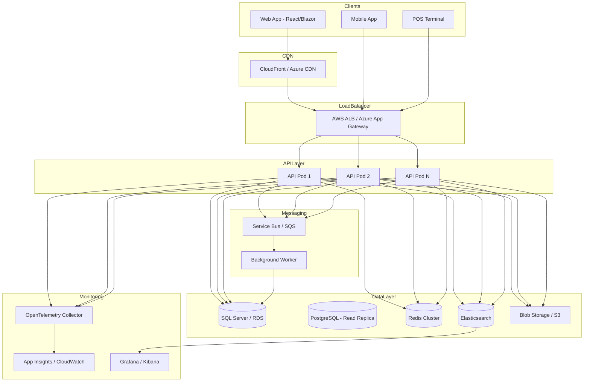

# Karasu ERP — Deployment Architecture (Azure & AWS)

---

## 1. High-Level Production Architecture



---

## 2. Azure Deployment

### 2.1 Resource Group Layout

```
rg-karasu-erp-prod
├── Azure Kubernetes Service (AKS)
│   ├── Node Pool: system (2x Standard_D2s_v3)
│   └── Node Pool: app (3-10x Standard_D4s_v3, autoscale)
├── Azure SQL Database (Business Critical, geo-replica)
├── Azure Cache for Redis (Premium P1, clustering)
├── Azure Service Bus (Premium)
├── Azure Blob Storage (Hot tier)
├── Azure Application Gateway (WAF enabled)
├── Azure CDN (static assets)
├── Azure Key Vault (secrets, certificates)
├── Azure Container Registry (ACR)
├── Log Analytics Workspace
├── Application Insights
└── Azure Front Door (global load balancing)
```

### 2.2 AKS Workloads

| Deployment | Replicas | Resources |
|------------|----------|-----------|
| `karasu-api` | 3-10 (HPA) | 500m CPU, 512Mi RAM |
| `karasu-worker` | 2-5 | 250m CPU, 256Mi RAM |
| `karasu-signalr` | 2-3 | 250m CPU, 256Mi RAM |

### 2.3 Azure DevOps Pipeline

```yaml
# pipelines/azure-pipelines.yml
trigger:
  branches: [main, develop]

stages:
  - stage: Build
    jobs:
      - job: BuildAndTest
        steps:
          - task: DotNetCoreCLI@2  # restore, build, test
          - task: Docker@2          # build & push to ACR
          - task: SonarQubePrepare@5

  - stage: Deploy_Staging
    dependsOn: Build
    jobs:
      - deployment: DeployAKS
        environment: staging
        strategy:
          canary:
            increments: [25, 50, 100]

  - stage: Deploy_Production
    dependsOn: Deploy_Staging
    condition: and(succeeded(), eq(variables['Build.SourceBranch'], 'refs/heads/main'))
```

### 2.4 Azure Estimated Monthly Cost (Production)

| Service | Spec | ~Cost |
|---------|------|-------|
| AKS | 3 nodes D4s_v3 | $400 |
| Azure SQL | BC Gen5 4 vCore | $600 |
| Redis Premium P1 | 6GB | $250 |
| App Gateway + WAF | Standard v2 | $200 |
| Blob + CDN | 100GB | $50 |
| App Insights | 5GB/day | $100 |
| **Total** | | **~$1,600/mo** |

---

## 3. AWS Deployment

### 3.1 Resource Layout

```
VPC (10.0.0.0/16)
├── Public Subnets (ALB, NAT)
├── Private Subnets (EKS, RDS, ElastiCache)
└── Database Subnets (RDS Multi-AZ)

EKS Cluster
├── Managed Node Group (app): t3.large x 3-10
├── Fargate Profile (worker jobs)

RDS SQL Server (Multi-AZ, db.r5.xlarge)
RDS PostgreSQL (Read Replica)

ElastiCache Redis (cluster mode, 3 shards)
S3 (documents, exports, product images)
CloudFront (CDN)
SQS + SNS (messaging)
Secrets Manager
ECR (container registry)
CloudWatch + X-Ray
WAF (on ALB)
```

### 3.2 GitHub Actions Pipeline

```yaml
# pipelines/github-actions.yml
name: CI/CD
on:
  push:
    branches: [main, develop]
  pull_request:
    branches: [main]

jobs:
  build-test:
    runs-on: ubuntu-latest
    steps:
      - uses: actions/checkout@v4
      - uses: actions/setup-dotnet@v4
        with:
          dotnet-version: '8.0.x'
      - run: dotnet restore && dotnet build && dotnet test

  docker-push:
    needs: build-test
    runs-on: ubuntu-latest
    steps:
      - uses: aws-actions/configure-aws-credentials@v4
      - uses: aws-actions/amazon-ecr-login@v2
      - run: docker build -t $ECR_REPO:$GITHUB_SHA .
      - run: docker push $ECR_REPO:$GITHUB_SHA

  deploy:
    needs: docker-push
    runs-on: ubuntu-latest
    steps:
      - run: aws eks update-kubeconfig
      - run: kubectl set image deployment/karasu-api api=$ECR_REPO:$GITHUB_SHA
      - run: kubectl rollout status deployment/karasu-api
```

### 3.3 AWS Estimated Monthly Cost

| Service | Spec | ~Cost |
|---------|------|-------|
| EKS | Control plane + 3 nodes | $350 |
| RDS SQL Server | db.r5.xlarge Multi-AZ | $700 |
| ElastiCache | cache.r5.large x 3 | $300 |
| ALB + WAF | | $100 |
| S3 + CloudFront | | $50 |
| CloudWatch | | $80 |
| **Total** | | **~$1,580/mo** |

---

## 4. Kubernetes Manifests Overview

```
k8s/
├── base/
│   ├── namespace.yaml
│   ├── api-deployment.yaml
│   ├── api-service.yaml
│   ├── worker-deployment.yaml
│   ├── ingress.yaml
│   ├── hpa.yaml                    # CPU > 70% → scale
│   ├── configmap.yaml
│   └── secrets.yaml                # sealed-secrets
├── overlays/
│   ├── staging/
│   │   └── kustomization.yaml
│   └── production/
│       └── kustomization.yaml
```

### HPA Configuration

```yaml
apiVersion: autoscaling/v2
kind: HorizontalPodAutoscaler
metadata:
  name: karasu-api-hpa
spec:
  scaleTargetRef:
    apiVersion: apps/v1
    kind: Deployment
    name: karasu-api
  minReplicas: 3
  maxReplicas: 10
  metrics:
    - type: Resource
      resource:
        name: cpu
        target:
          type: Utilization
          averageUtilization: 70
```

---

## 5. Environment Strategy

| Environment | Purpose | Database | URL |
|-------------|---------|----------|-----|
| **Local** | Development | Docker SQL + Redis | localhost:5000 |
| **Dev** | Feature testing | Shared dev DB | dev-api.karasuerp.com |
| **Staging** | Pre-production | Staging DB (prod copy) | staging-api.karasuerp.com |
| **Production** | Live | Multi-AZ, replicas | api.karasuerp.com |

---

## 6. Disaster Recovery

| RPO | RTO | Strategy |
|-----|-----|----------|
| 1 hour | 4 hours | Automated backups + geo-replica |

- SQL: Point-in-time restore (35 days)
- Redis: AOF persistence + daily RDB snapshot
- Blob: Geo-redundant storage (GRS)
- Runbook: Failover to secondary region documented

---

## 7. SSL/TLS & Secrets

- TLS 1.3 termination at load balancer
- mTLS between services (service mesh — optional Istio)
- Azure Key Vault / AWS Secrets Manager for:
  - DB connection strings
  - JWT signing keys
  - Redis passwords
  - E-Invoice API credentials
  - SendGrid/SMTP keys

---

## 8. Blue-Green / Canary Deployment

```
Production Traffic (100%)
    ↓
[Blue - v1.2.0] ← current
[Green - v1.3.0] ← new (0% → 25% → 50% → 100%)

Health check pass → shift traffic → decommission Blue
Health check fail → rollback to Blue (instant)
```
